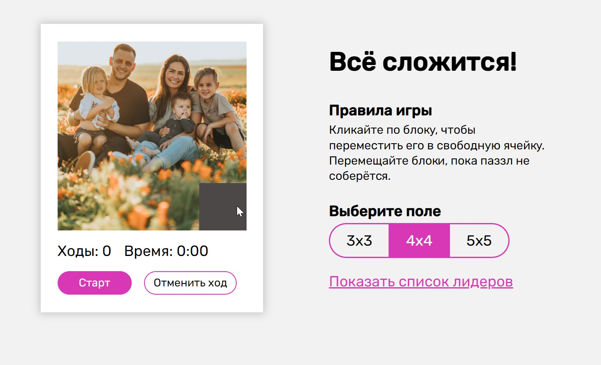
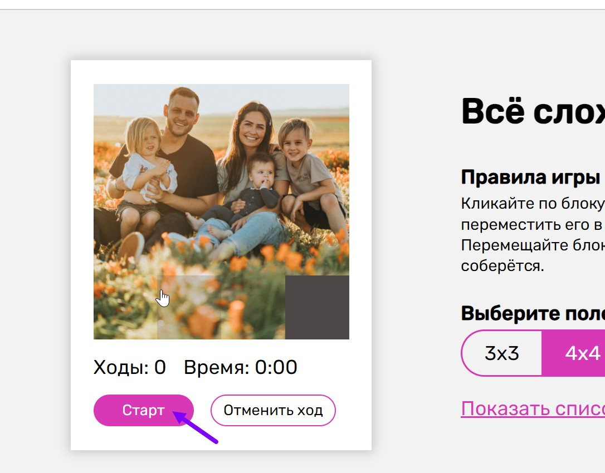
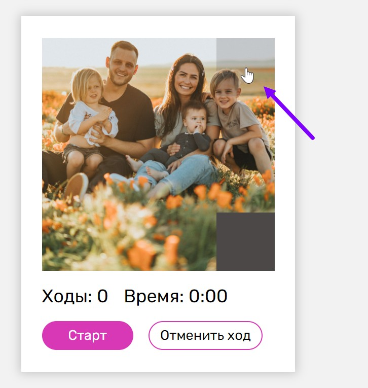
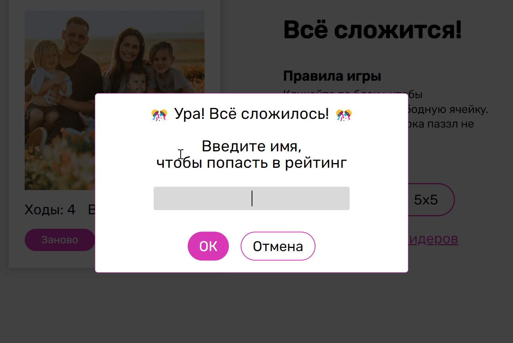
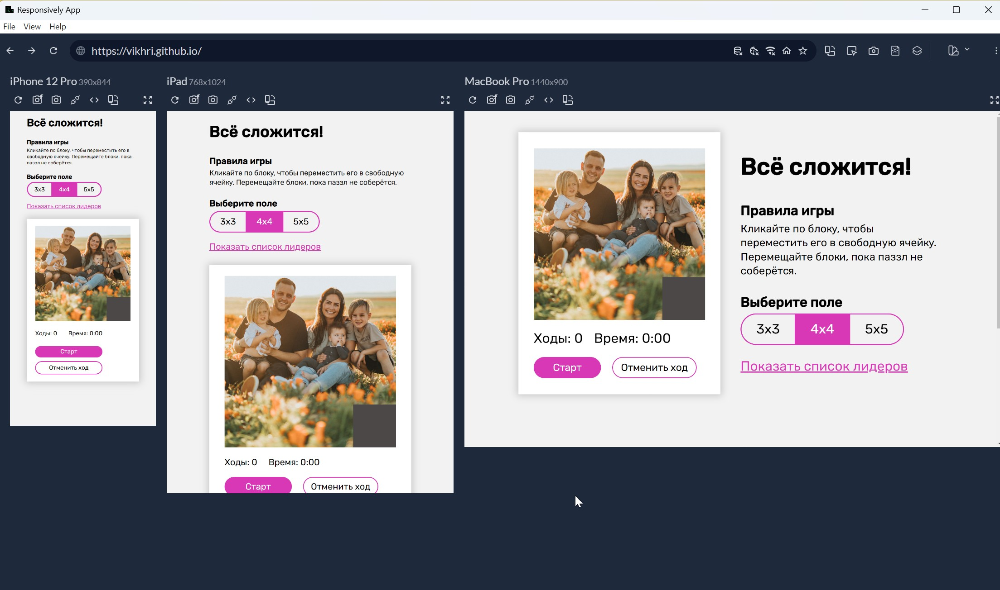
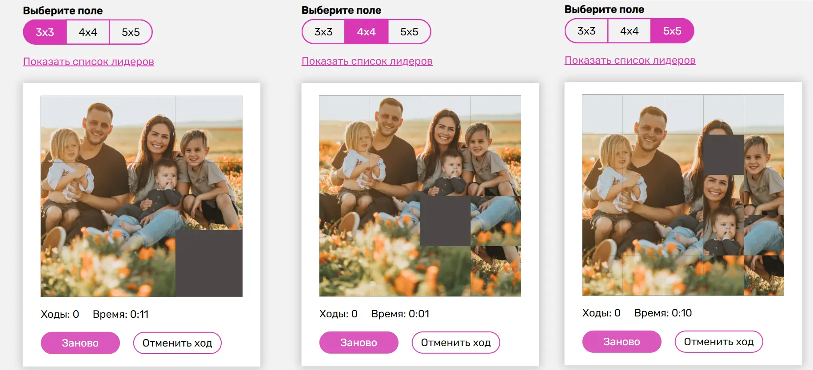
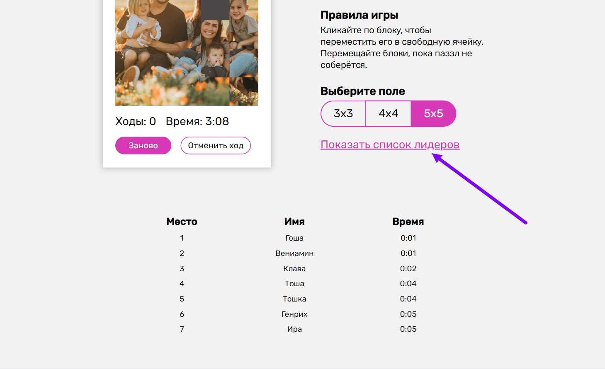

# Команда №20 Хакатона

## Состав:

- Кирилл https://t.me/KirillTheStranger
- Игорь https://t.me/ishipilov
- Ира https://t.me/irina_vikhrova
- Генрих https://t.me/gendzmin

## Проект "Всё сложится":

## [Deploy](https://allgoeswell.vercel.app/)

### Фичи:

#### Базовые:

- Вывод поля с пятнашками и правилами игры.
- Стандартное поле - 4х4, в нем иллюстрация, разделенная на 15 частей, и пустое окошко.

Игровое поле 4х4, описание игры и опции выводим сразу на стартовом экране.

#### Игра начинается при клике на кнопку "Старт".

- На каждую новую партию должно быть новое распределение кусочков;
- Возможность начать игру заново;

Новую партию, можно начать по клику на кнопку "Заново".

На каждую новую партию генерится новое расположение картинок. Запутывание картинок происходит не рандомно, а с помощью рандомного количества обратных ходов из выигрышного положения. Так сделано, чтобы задачу точно можно было решить.

При окончании игры, пропадает возможность двигать блоки, пока не нажмешь кнопку "Заново".

- Удобно подсвеченная навигация, которая показывает, какой из элементов будет перемещен.

При наведении на квадраты можно увидеть, что выбранный квадрат затемнен.

Так как выбор направления движения уже сильно ограничен, других подсказок по навигации не делаем.

- Экран поздравления с окончанием игры.

При удачном прохождении игры, выплывает окошко с позравлением.

В окне можно ввести имя пользователя, чтобы записать себя в лидер борд.
При клике на "ОК", отправляем Имя, Время в облачную БД firebase.
При клике на "Отмена" ничего не происходит, окошко просто закрывается.

#### Дополнительные:

- Адаптив

Вёрстка адаптивная и корректно отображается на разных размерах экрана.

- Возможность изменения размера поля

Можно выбрать из значений 3х3, 4х4 и 5х5.

Чтобы начать игру с выбранным полем, нужно нажать "Старт", либо нажать "Заново" после того, как выбрали размер поля.

- Возможность отменить ход

Ходы откручиваются назад при клике на кнопку "Отменить ход".

- Возможность игры стрелками.

Можно играть в игру, используя стрелки клавиатуры.

- Лидерборд

При клике на "Показать список лидеров" раскрывается список участников.
Список участников мы храним в облачной БД. Делаем запрос и рендерим таблицу.

Чтобы развернуть проект локально, выполните команду:
`npm run dev`
